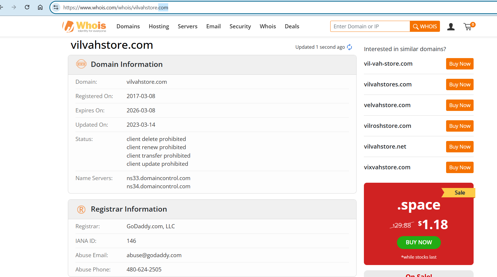
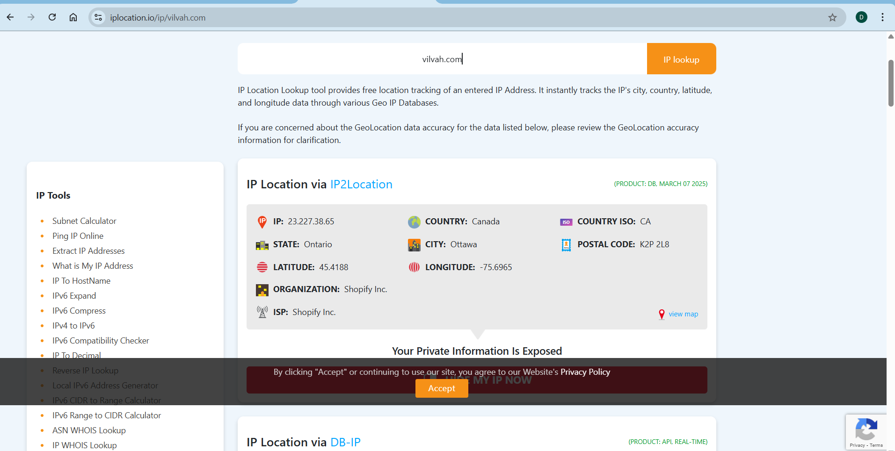
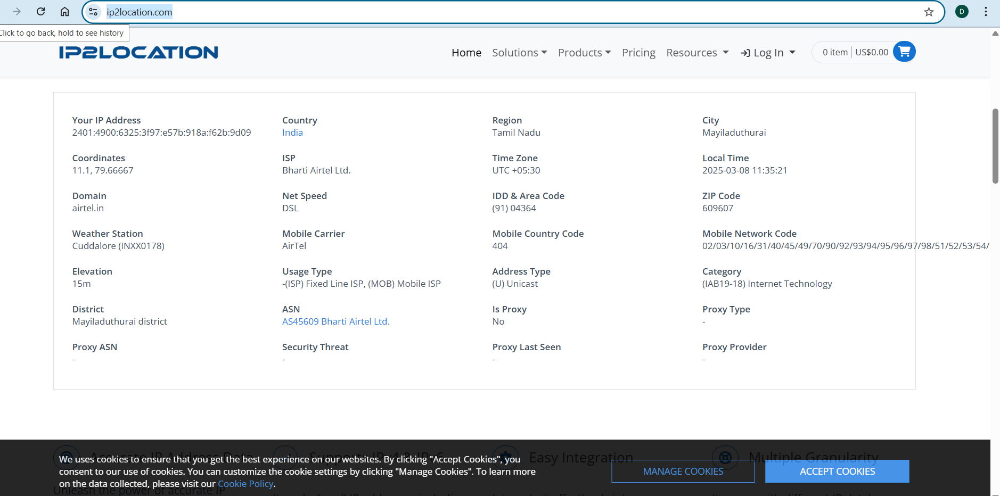
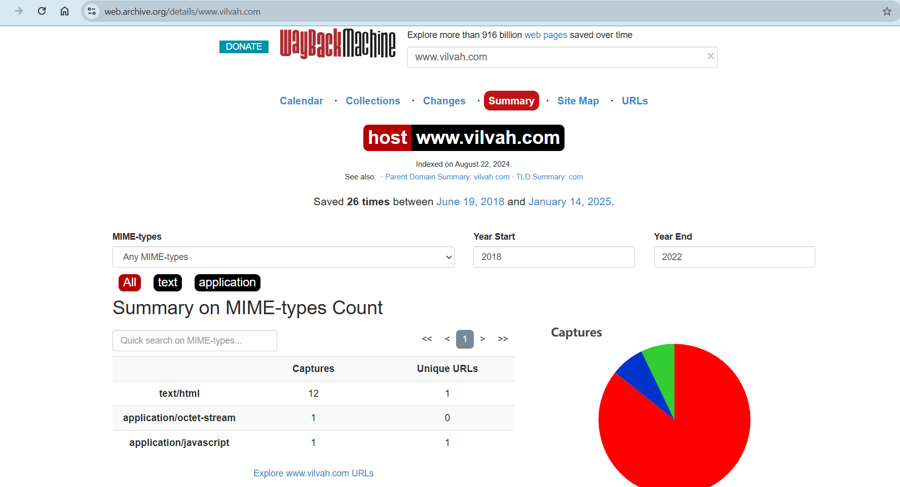
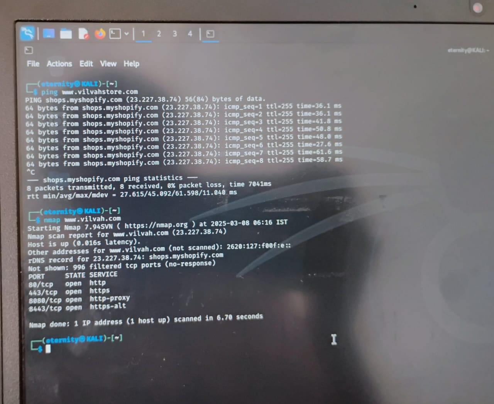
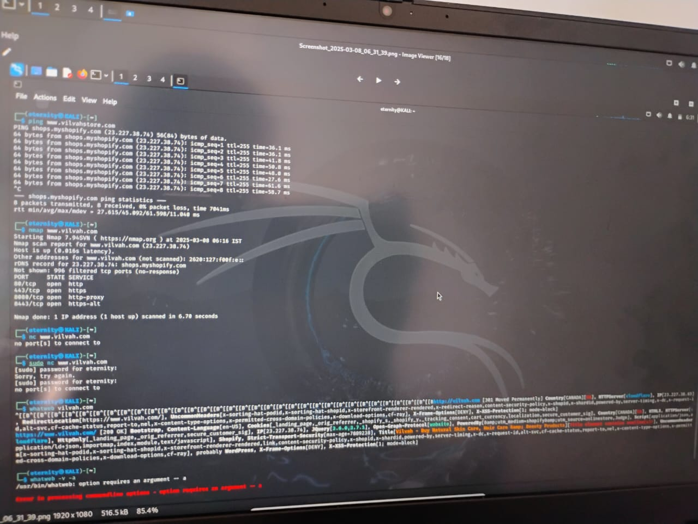
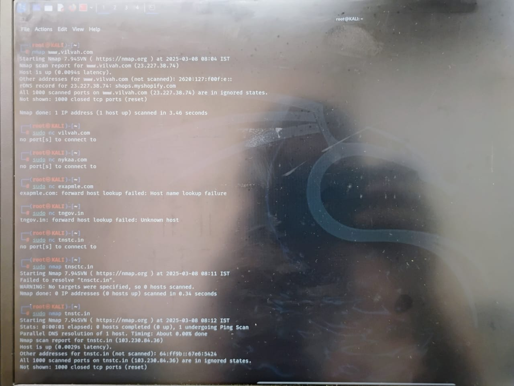
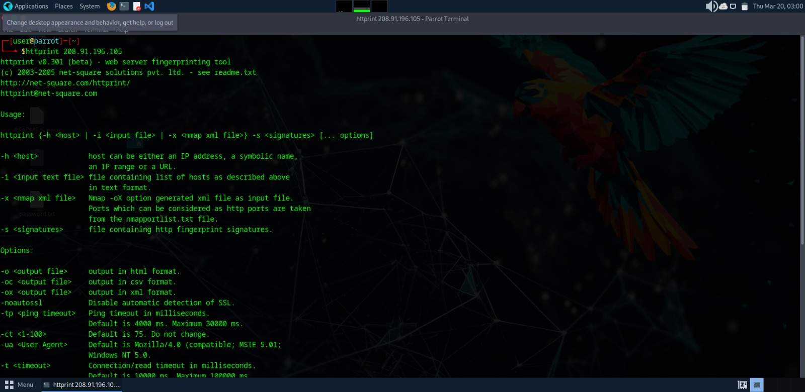
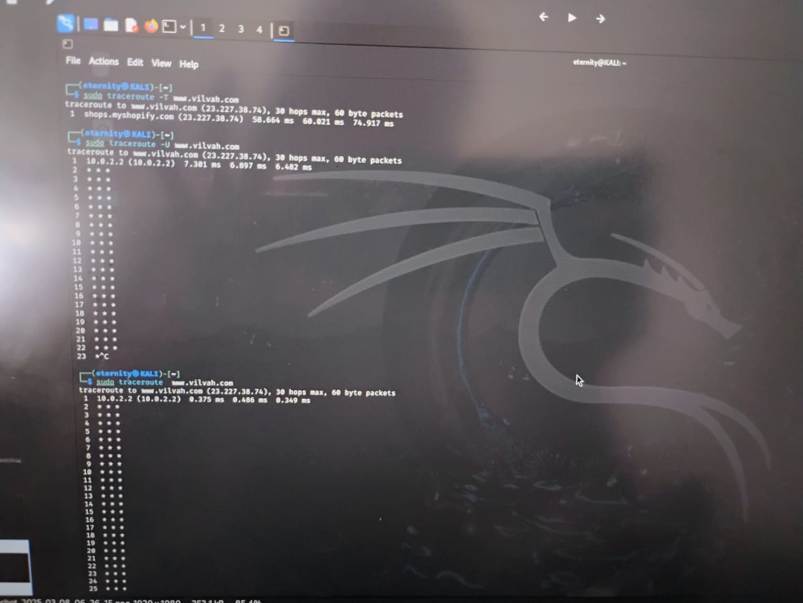

# InformationGathering
Information Gathering Techiques

# To perform information gathering techniques

# AIM:

To perform information gathering techniques using kali linux 

## STEPS:

### Step 1:

Install kali linux either in partition or virtual box or in live mode

### Step 2:

Investigate on the various categories of tools as follows:

### Step 3:
Open terminal/browser and try execute necessary commands/use url to perform information gathering

## OUTPUT:

## Pen Test Tools Categories:  

Following Categories of pen test tools are identified for information gathering:

Footprinting is a part of the reconnaissance process which is used for gathering possible information about a target computer system or network.
http://www.whois.com/whois website to get detailed information about a domain name information including its owner, its registrar, date of registration, expiry, name server, owner's contact information, etc.

## output :

### Finding Hosting Company
get further detail by using ip2location.com website.
## output:

### History of the website:
## output
### https://web.archive.org/

# Webserver Fingerprinting:

## Netcat:
sudo nc example.com 80
## nmap:
## Whatweb

## httprint:

# Tracing the Location
### TCP Traceroute:
sudo traceroute -T www.vilvah.com

### UDP Traceroute:
sudo traceroute -U www.vilvah.com

### ICMP Traceroute:
sudo traceroute  www.google.com
##output

## RESULT:
The information gathering techniques tools/procedure were  identified successfully
